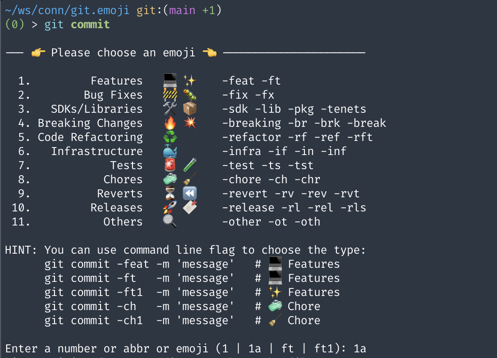

# git.emoji

git.emoji is a tool written in Go that allows you to use emojis in your commit messages. It provides a simple command-line interface to help you select the right emoji for your commit. It will setup git hooks to commit with emoji, and can be used as a wrapper of git.

Whether you are fixing a bug, adding a new feature, or updating documentation, you can now express yourself with emojis!

Read more at the [introduction article](https://blog.connectly.ai/commit-your-code-in-style-with-git-emoji-d9ac745ee155).

[](a.mov)

## Install

### Install from source

Download Go from [official website](https://go.dev/doc/install), then run:

```bash
git clone github.com/connectlyai/git.emoji
cd git.emoji
./build.sh
```

## Setup

Add git.emoji to your PATH, then:

```bash
which git.emoji
# 👉 make sure you have git.emoji in the PATH

git.emoji setup-hooks
```

You can optionally use git.emoji as git alias by adding this to your `.bashrc` or `.zshrc`:

```bash
alias git=git.emoji
```

And enjoy using git as usual but with the extra emoji.

## Config

To customize your emoji, use:

```bash
git.emoji write-config
```

to save the default [emoji.config](emoji.config) to your favourite place. Currently, it supports:

- `<YOUR_REPOSITORY>/.git/emoji.config`
- `<YOUR_REPOSITORY>/emoji.config`

With the first way, you can customize the emojis for your local repository only. With the second way, you can customize and share the emojis with your team in the repository.

You can then edit the file to customize your emoji.

## Usage

### 1. Commit your commit as usual, and git.emoji will ask you to input emoji

```bash
git commit
```

The `git.emoji` will ask you to choose the emoji:

```text
--- 👉 Please choose an emoji 👈 ----------------------

  1.         Features    💻 ✨  -feat -ft
  2.        Bug Fixes    🚧 🐛  -fix -fx
  3.   SDKs/Libraries    🛠️ 📦  -sdk -lib -pkg -tenets
  4. Breaking Changes    🔥 💥  -breaking -br -brk -break
  5. Code Refactoring    ♻️     -refactor -rf -ref -rft
  6.   Infrastructure    🐳     -infra -if -in -inf
  7.            Tests    🚨 🧪  -test -ts -tst
  8.           Chores    🧼 🧹  -chore -ch -chr
  9.          Reverts    ⏳ ⏪  -revert -rv -rev -rvt
 10.         Releases    🚀 🔖  -release -rl -rel -rls
 11.           Others    🔍     -other -ot -oth

HINT: You can use command line flag to choose the type:
      git commit -feat -m 'message'   # 💻 Features
      git commit -ft   -m 'message'   # 💻 Features
      git commit -ft1  -m 'message'   # ✨ Features
      git commit -ch   -m 'message'   # 🧼 Chore
      git commit -ch1  -m 'message'   # 🧹 Chore

Enter a number or abbr or emoji (1 | 1a | ft | ft1):
```

### 2. Use `git.emoji commit -feat -m <message>` to add emoji to your commit

You can use alias as flag to quickly add emoji to your commit.

```bash
git.emoji commit -feat -m 'message'   # 💻 Features
git.emoji commit -ft   -m 'message'   # 💻 Features
git.emoji commit -ft1  -m 'message'   # ✨ Features
git.emoji commit -ch   -m 'message'   # 🧼 Chore
git.emoji commit -ch1  -m 'message'   # 🧹 Chore
```

### 3. Use `git commit -feat -m <message>` to add emoji to your commit

After setting `alias git=git.emoji`, you can use git as usual with the extra feature of adding emoji.

```bash
git commit -feat -m 'message'   # 💻 Features
git commit -ft   -m 'message'   # 💻 Features
git commit -ft1  -m 'message'   # ✨ Features
git commit -ch   -m 'message'   # 🧼 Chore
git commit -ch1  -m 'message'   # 🧹 Chore
```

### 4. It works with rebase, merge, and other git commands

Not just committing, whenever you use git commands that involve committing, such as `rebase`, `merge`, or `cherry-pick`, if there is a commit message without emoji, git.emoji will prompt you to select an emoji for the commit message. This way, you can ensure that all your commits are consistent and expressive.

## Author

[](https://olivernguyen.io)&nbsp;&nbsp;[](https://github.com/iOliverNguyen)
